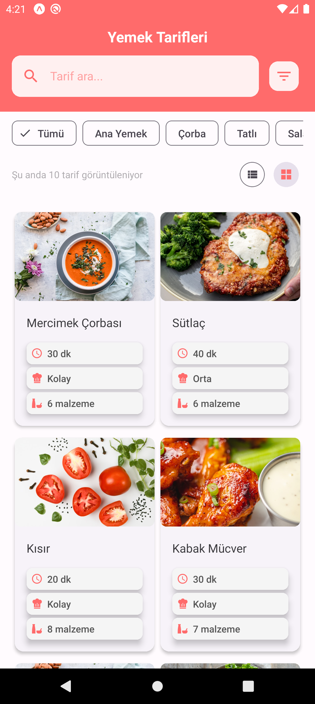
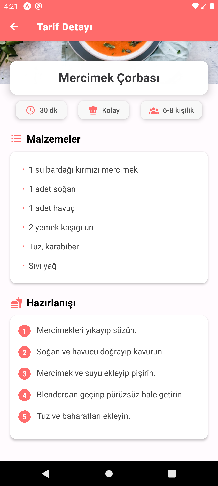
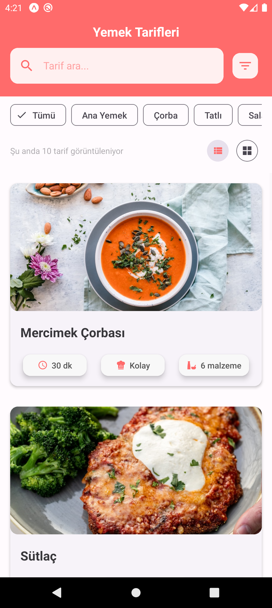
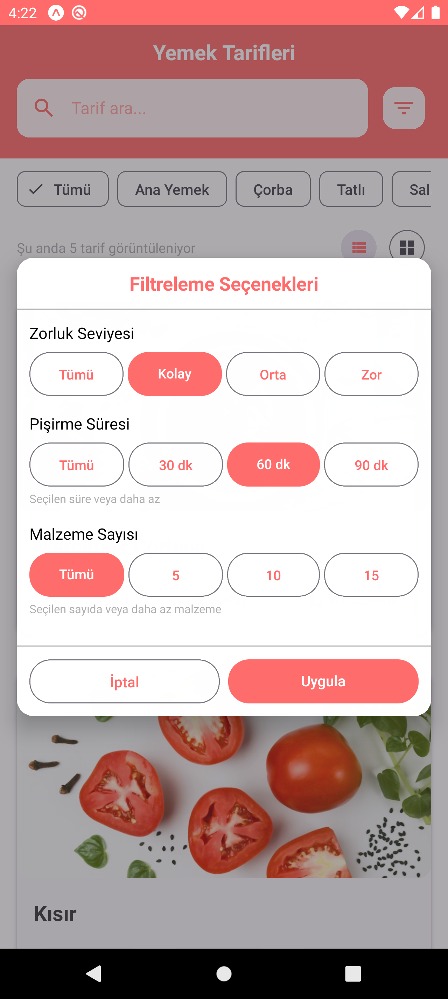

# 📱 Yemek Tarifleri Uygulaması

Modern ve kullanıcı dostu bir arayüze sahip React Native yemek tarifleri uygulaması.

## 🚀 Özellikler

- 📖 Kategorilere göre yemek tarifleri
- 🔍 Tarif arama
- ⚡ Gelişmiş filtreleme seçenekleri:
  - Zorluk seviyesi
  - Pişirme süresi
  - Malzeme sayısı
- 📊 Liste ve ızgara görünüm seçenekleri
- 🎨 Modern ve kullanıcı dostu arayüz
- 📱 iOS ve Android desteği

## 🛠 Ekran Görüntüleri

<div style="display: flex; flex-wrap: wrap; gap: 10px;">







</div>

## 🛠️ Kullanılan Teknolojiler

- React Native
- Expo
- React Native Paper (UI Kütüphanesi)
- React Navigation

## 🚀 Kurulum

1. Projeyi klonlayın:

```bash
git clone https://github.com/oguuzduran/yemek-tarifleri.git
```

2. Proje dizinine gidin:

```bash
cd yemek-tarifleri
```

3. Gerekli paketleri yükleyin:

```bash
npm install
```

4. Uygulamayı başlatın:

```bash
npm start
```

## 📱 Katkıda Bulunma

1. Bu projeyi fork edin
2. Yeni bir branch oluşturun (`git checkout -b feature/yeniOzellik`)
3. Değişikliklerinizi commit edin (`git commit -am 'Yeni özellik: XYZ'`)
4. Branch'inizi push edin (`git push origin feature/yeniOzellik`)
5. Pull Request oluşturun

## 📝 Lisans

Bu proje MIT lisansı altında lisanslanmıştır. Daha fazla bilgi için `LICENSE` dosyasına bakın.

## 👥 Geliştirici

- Oğuzhan Duran
